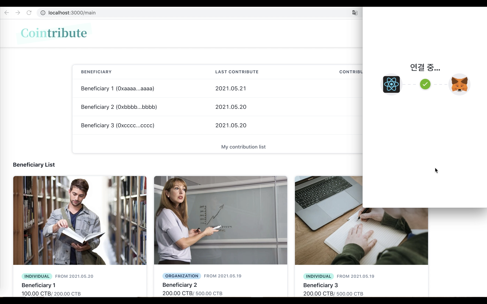
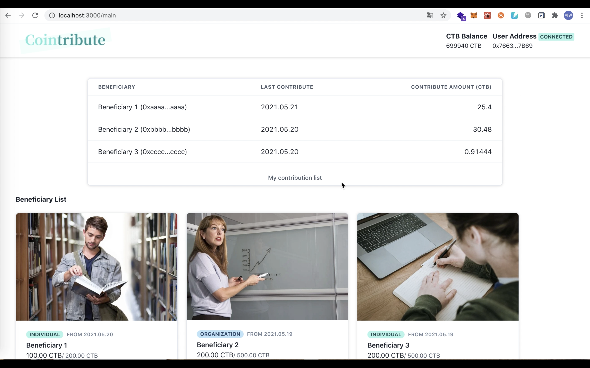
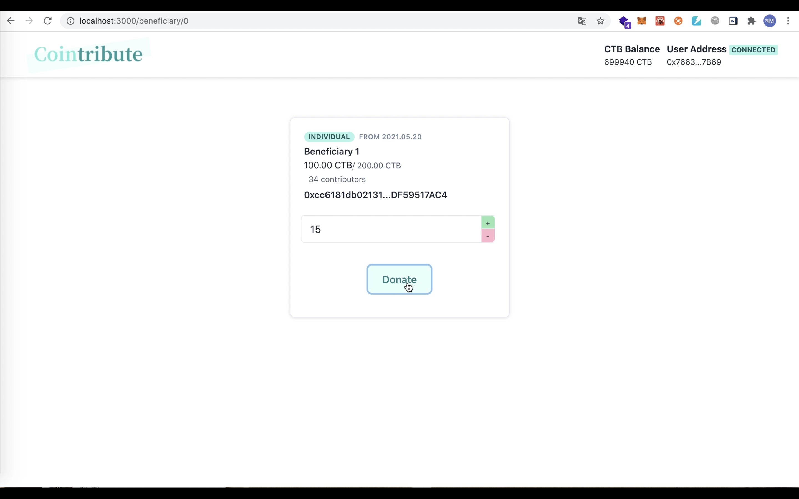
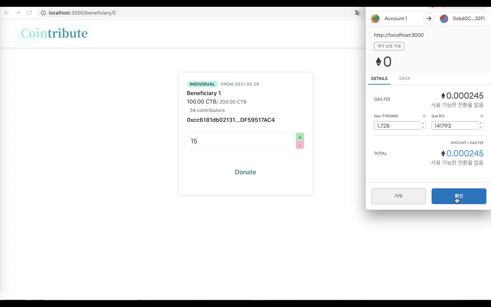
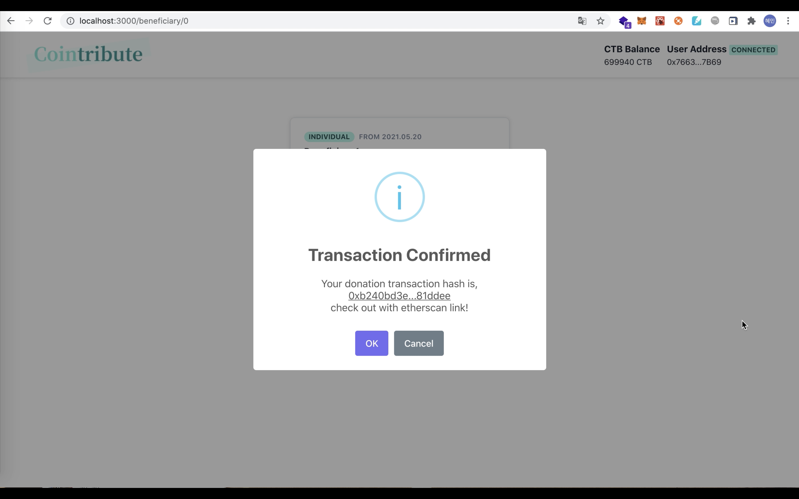

# Cointribute

## 2021-1 블록체인의 실무응용 프로젝트

### 개발스택

1. Dapp : `CRA(Create-React-App)`, `web3-react/core`, `ethersproject`
2. UI : `chakra-ui/react`, `sweetalert2`
3. Infra : `Docker`

### 기능 구현

1. Metamask 지갑 연결
   

2. 전체 기부리스트 조회
   

3. 원하는 액수의 CTB 기부
   

4. 트랜잭션 생성
   

5. 트랜잭션 조회 (이더스캔 연결)
   
